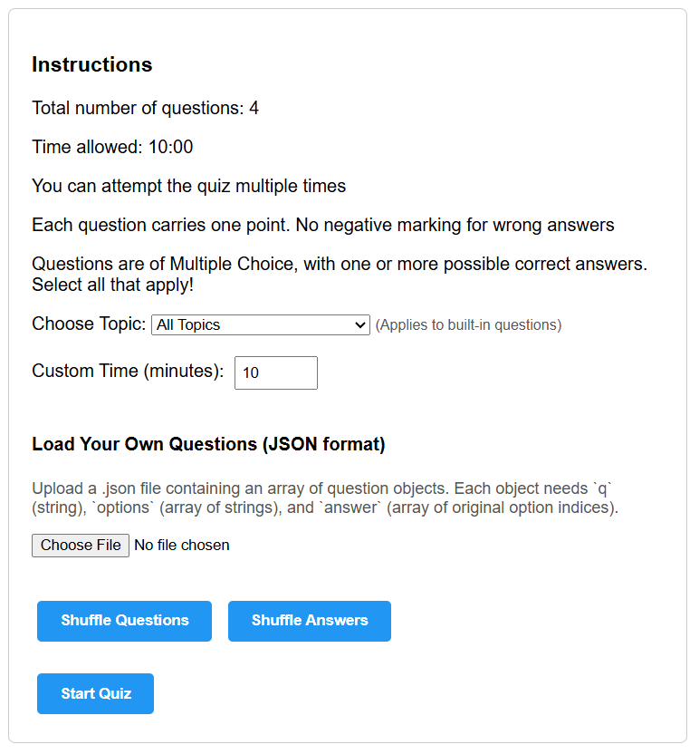
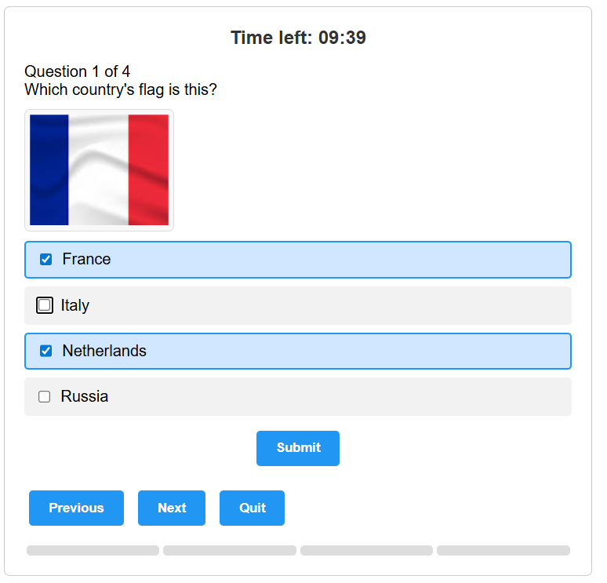
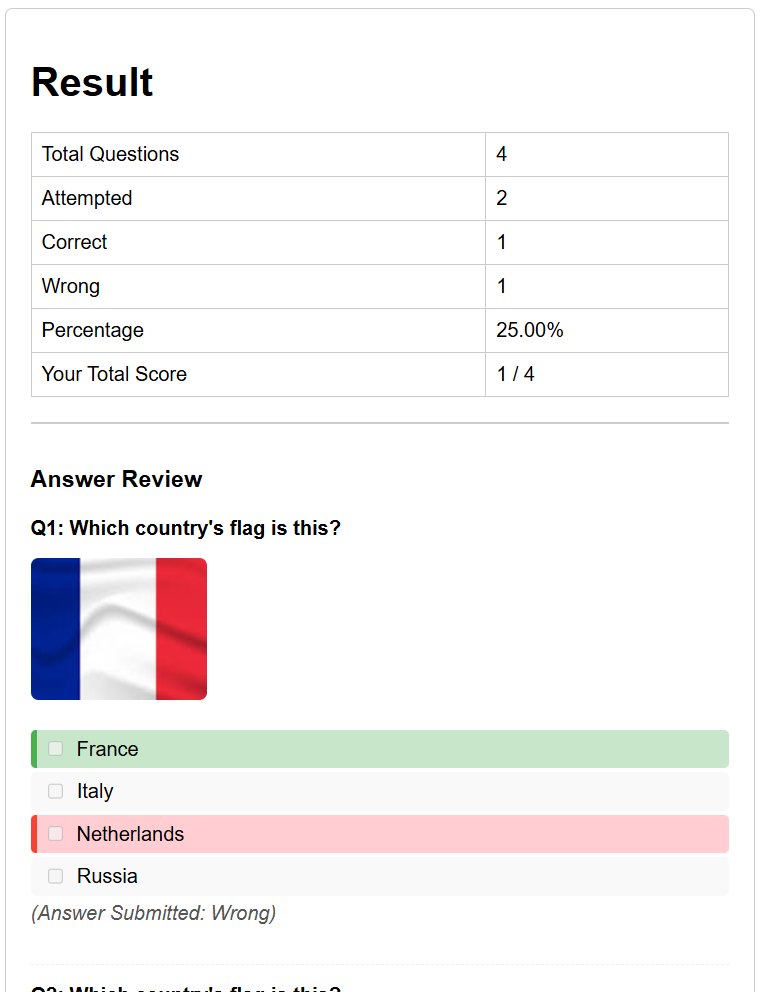

# Web Quiz App - Drill

This is a simple responsive web-based quiz application built using HTML, CSS, and JavaScript. Users can select topics, answer multiple-choice questions, and view their results with detailed answer reviews.

**Try the live demo here:**  
[https://simadmiral.github.io/Exam_Driller/](https://simadmiral.github.io/Exam_Driller/)

## Screenshots
<div style="display: flex; gap: 20px; flex-wrap: wrap; justify-content: center;">

  <div>
    <p align="center"><strong>Home Screen</strong></p>
    
  </div>

  <div>
    <p align="center"><strong>Question Display</strong></p>
    
  </div>

  <div>
    <p align="center"><strong>Result Overview</strong></p>
    
  </div>

</div>

## Features

- ✅ Topic selection (e.g., Sports, Logic, Computer, etc.)
- 🔀 Shuffled questions and shuffled answers on each start
- 🕒 Countdown timer (default: 5 minutes)
- 📊 Result summary (correct, wrong, attempted, score)
- 🔁 Try again / restart quiz
- 📖 End-of-quiz answer review
- 🖼️ Image support for visual questions

## Importing Your Own Questions

You can also import your own quiz questions by providing a JSON file with the following format:

```json
[
  {
    "q": "Which country's flag is this?",
    "img": "https://upload.wikimedia.org/wikipedia/commons/6/62/Flag_of_France.png",
    "options": ["France", "Italy", "Netherlands", "Russia"],
    "answer": [0],
    "topic": "flags"
  },
  {
    "q": "Which country's flag is this?",
    "img": "https://upload.wikimedia.org/wikipedia/commons/d/de/Flag_of_the_United_States.png",
    "options": ["Canada", "United Kingdom", "United States", "Australia"],
    "answer": [2],
    "topic": "flags"
  },
  {
    "q": "What is the capital of Germany?",
    "options": ["Munich", "Berlin", "Frankfurt", "Hamburg"],
    "answer": [1],
    "topic": "capitals"
  },
  {
    "q": "What is the capital of Japan?",
    "options": ["Kyoto", "Seoul", "Tokyo", "Osaka"],
    "answer": [2],
    "topic": "capitals"
  }
]
```

### Explanation of each field:

| Field    | Type       | Description                                                                                   | Optional |
|----------|------------|-----------------------------------------------------------------------------------------------|----------|
| `q`      | string     | The text of the question.                                                                     | No       |
| `img`    | string     | URL or path to an image related to the question (e.g., flag). If no image, omit this field.    | Yes      |
| `options`| array      | An array of answer choices (strings) to select from.                                         | No       |
| `answer` | array      | Array of indices (starting at 0) representing correct answer(s).                             | No       |
| `topic`  | string     | Category name for grouping/filtering questions (e.g., "flags", "capitals", "sports").        | No       |

---

- **`q`**: The question you want to ask.
- **`img`**: Optional image URL or relative path for visual questions.
- **`options`**: List all answer options the user can pick.
- **`answer`**: Index(es) of correct answer(s). Example: `[0]` for first option, `[1, 3]` for multiple correct answers.
- **`topic`**: Used to filter questions by category in the app.
